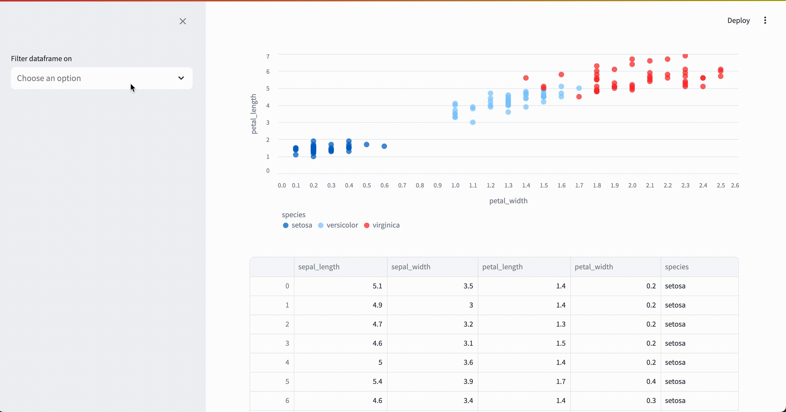

# Streamlit Data Filter

Provides a UI to filter a pandas dataframe in a streamlit application.

The code is heavily borrowed from [this streamlit tutorial](https://blog.streamlit.io/auto-generate-a-dataframe-filtering-ui-in-streamlit-with-filter_dataframe/).

## Installation

<!-- ```shell
pip install st-datafilter
``` -->

From source:

```shell
git clone https://github.com/maxwelllevin/st-datafilter.git
cd st-datafilter
pip install .
```

## Usage



Code:

```python
import pandas as pd
import seaborn as sns  # pip install seaborn
import streamlit as st

from st_datafilter import filter_dataframe

df = sns.load_dataset("iris")
df["species"] = pd.Categorical(df["species"])

with st.sidebar:
    df = filter_dataframe(df, show_histograms=True)

st.scatter_chart(df, x="petal_width", y="petal_length", color="species")
st.dataframe(df, use_container_width=True)
```
